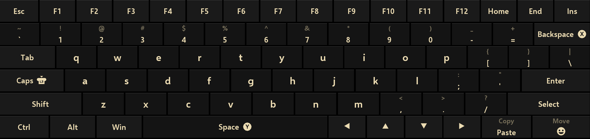

# DualTouch

<p align="center">
  
</p>

**A fast, native on-screen keyboard for the Steam Controller on Windows.**


DualTouch is a native SDL3 on-screen keyboard built around the idea of
Steam's touch keyboard, but with a lot more behind it. The controller is
read directly from the HID device — no web layer, no Steam UI stack — so it
opens fast, types immediately, and sits on top of the desktop, windowed
games, and fullscreen apps alike.

It is a Windows-only fork of [SteamlessKeyboard](https://github.com/PietPetGit/SteamlessKeyboard)
(originally from `archshift/triton`).

## Table of Contents

- [Features](#features)
- [Requirements](#requirements)
- [Quick Start](#quick-start)
- [Configuration](#configuration)
- [Building](#building)
- [Troubleshooting](#troubleshooting)
- [Development Notes](#development-notes)
- [License](#license)

## Features

- **Global overlay** — draws above every app, not tied to Big Picture or a launcher.
- **Native SDL3 rendering** — low CPU/memory use; skins, transparency, and size selectable from the tray.
- **Steam Controller input** — two-finger trackpad typing with hit-target expansion and debounce, DPAD/stick navigation, auto-repeat on held keys, configurable insert control (bumpers or triggers).
- **Steam Input coexistence** — reads the shared HID alongside Steam Input, switches to a keyboard layer via `steam://forceinputappid`, and restores your config on close.
- **Opens with a chord** — Steam + X/Y/A/B (configurable) opens the keyboard; Steam's own menu is suppressed via a Guide Button Chord dead-binding.
- **Per-app memory** — remembers the OSK size, skin, and position per foreground app.
- **Sounds & haptics** — Steam's click sound and rumble feedback, both toggleable.
- **Tray app** — battery status, open/close keyboard, autostart, chord selection, skin menu.
- **Elevated by design** — runs elevated so it can type into Big Picture and UIPI-protected games.

<p align="center">
  
</p>

## Requirements

- Windows 10 or 11 (64-bit)
- [Steam](https://store.steampowered.com), running, with Steam Input available — DualTouch waits for it on launch
- Python 3.10+ if running from source (not needed for the prebuilt exe)

## Quick Start

**Release build**

Run `DualTouch-windows.exe` (it will request elevation on start).

- Settings: `%APPDATA%\DualTouch\settings.json` (auto-created with defaults; a legacy file next to the exe is migrated automatically)
- Logs: `%APPDATA%\DualTouch\dualtouch.log`

**From source**

```sh
pip install -r requirements.txt
cd windows
python -m tray
```

## Configuration

Most settings are live-editable from the tray (Startup and Steam Controller
menus), or by hand-editing `settings.json` for finer control.

| Key | Default | Meaning |
| --- | --- | --- |
| `sc_osk_open_chord` | `"X"` | Button that opens the keyboard when held with Steam: `"X"`/`"Y"`/`"A"`/`"B"` |
| `sc_click_button` | `"L1/R1"` | Click insert per side: `"L1/R1"` (bumpers) or `"L2/R2"` (triggers) |
| `sc_pad_click_enter` | `false` | Trackpad press-click inserts the key under the pointer |
| `sc_pad_click_engage` | `2500` | Pad force that fires the pad-click insert |
| `sc_left_stick_nav` | `true` | Sticks control the keyboard while it is open |
| `sc_osk_trigger_actuation` | `"default"` | L2/R2 actuation point: `"default"` or `"low"` |
| `skin` | `"Gruvbox"` | Keyboard skin: Steam OSK themes load from the Steam install; Gruvbox is the bundled original |
| `osk_size` | `"medium"` | `"small"`/`"medium"`/`"full"` |
| `osk_transparency` | `"off"` | `"off"`/`"low"`/`"medium"`/`"high"` |
| `osk_split_layout` | `false` | Split the keyboard into left/right halves with a middle gap; each touchpad covers its own half |
| `key_sound_enabled_sc` | `true` | Steam keyboard click sound |
| `rumble_enabled_sc` | `true` | Haptics on key clicks and trigger pulls |
| `steam_kbd_layer` | `true` | Dispatch the `forceinputappid` keyboard layer while open |
| `block_sc_hid` | `false` | Open the Steam Controller HID exclusively (Steam can't read it) |
| `start_with_windows` | `false` | Launch at logon (elevated scheduled task, no UAC prompt) |

## Building

```sh
cd windows
python build.py
```

Output: `windows/dist/DualTouch-windows.exe`.

## Troubleshooting

**Keyboard doesn't open**
Enable logging first (tray → Startup → Enable Logging), then check
`%APPDATA%\DualTouch\dualtouch.log`.

**Steam Input grabs the controller**
Confirm the keyboard-layer shortcut is registered (done automatically into
`shortcuts.vdf`) and that the keyboard opened with Steam running; cursor
containment and the injected-input gate keep Steam's emulated mouse out of
the keyboard.

**Controller dead after quitting**
Quitting from the tray never dispatches the `/0` restore; if the appid
changed another way, relaunch and open/close the keyboard once (or alt-tab)
to make Steam re-evaluate.

## Development Notes

This project was built through AI-assisted development: a human set the
direction, reviewed changes, and handled testing, while AI coding agents
wrote the implementation. It's shared partly as a working keyboard overlay,
and partly as a real-world example of what that workflow can produce.

## License

GNU LGPL v3 — see [LICENSE](LICENSE).

**Assets.** Valve's OSK themes and controller glyphs load from the Steam
install at runtime; bundled graphics are DualTouch's own.
